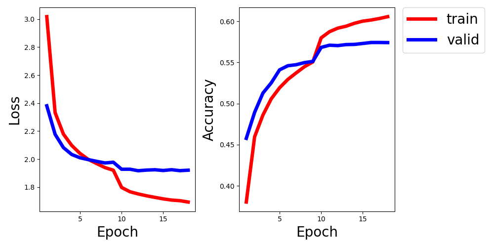

该项目学习了 https://github.com/tbmoon/basic_vqa 的工作，以期对VQA有深入地了解。
# 文献
Pytorch implementation of the paper - VQA: Visual Question Answering (https://arxiv.org/pdf/1505.00468.pdf).


## Usage 
#### 1. Download and unzip the dataset from official url of VQA: https://visualqa.org/download.html.

```bash
$ cd VQA_program/utils
$ chmod +x download_and_unzip_datasets.csh
$ ./download_and_unzip_datasets.csh
```

#### 2. Preproccess input data for (images, questions and answers).

```bash
-转换图片的型号
$ python resize_images.py --input_dir='../datasets/Images' --output_dir='../datasets/Resized_Images' 
-对问题做切词，制作问题词典，0:<pad>,1:<unk>;选取前1000个最大词频的answers,0:<unk>，相当于多分类问题
$ python make_vacabs_for_questions_answers.py --input_dir='../datasets'
-整合图片（名字、路径）、问题（id,问题str,切词列表）与答案（10个全部答案列表，有效答案列表（在answers字典中的answers））（从有效答案中随机选择一个作为标签）
$ python build_vqa_inputs.py --input_dir='../datasets' --output_dir='../datasets'
（resize_images.py需要替换注释函数）
```

#### 3. Train model for VQA task.

```bash
-载入数据、建立模型后开始训练
$ cd ..
$ python train.py
```
#### 4. plotter.py做结果图

- Loss and Accuracy on VQA datasets v2

