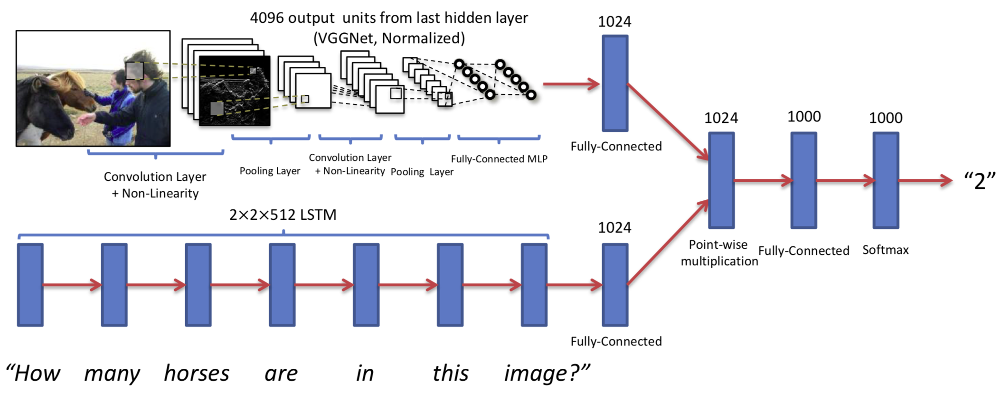

该项目学习了 https://github.com/tbmoon/basic_vqa 的工作，以期对VQA有深入地了解。
# 文献
Pytorch implementation of the paper - VQA: Visual Question Answering (https://arxiv.org/pdf/1505.00468.pdf).



## Usage 
#### 1. Download and unzip the dataset from official url of VQA: https://visualqa.org/download.html.

```bash
$ cd basic_vqa/utils
$ chmod +x download_and_unzip_datasets.csh
$ ./download_and_unzip_datasets.csh
```

#### 2. Preproccess input data for (images, questions and answers).

```bash
$ python resize_images.py --input_dir='../datasets/Images' --output_dir='../datasets/Resized_Images'  
$ python make_vacabs_for_questions_answers.py --input_dir='../datasets'
$ python build_vqa_inputs.py --input_dir='../datasets' --output_dir='../datasets'
（resize_images.py需要替换注释函数）
```

#### 3. Train model for VQA task.

```bash
$ cd ..
$ python train.py
```

- Loss and Accuracy on VQA datasets v2
'''plotter.py做结果图'''


